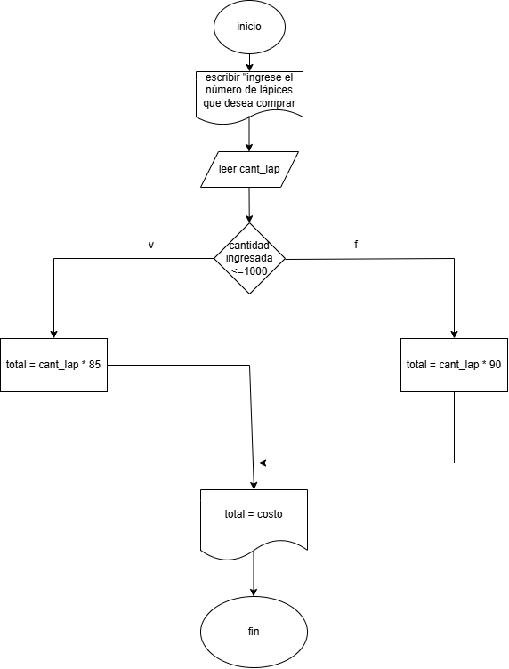

## 📤 Ejercicio 1.

Investiga cuáles son los símbolos que se utilizan para representar cada operación de un algorimo con un diagrama de flujo. Asegúrate de que la fuente es confiable, discute lo que encontraste con tus compañeros y con el profe. Cuando estés seguro/a de tener los símbolos correctos, consigna la información en la bitácora.


![imagen]

[def]: ./imagenes/diag_flujo_-_Algoritmo.jpg

## 📔 Reglas para el uso de diagramas de flujo

1. Todo diagrama de flujo debe tener un **inicio y** un **fin.** 
2. Las líneas utilizadas para indicar la dirección del flujo del  diagrama deben ser rectas: verticales u horizontales. 
3. Todas las líneas utilizadas para indicar la dirección del flujo  del diagrama deben estar conectadas. La conexión puede  ser a un símbolo que exprese lectura, proceso, decisión,  impresión, conexión o fin del diagrama. 
4. El diagrama de flujo debe construirse de arriba hacia abajo  (*top-down*) y de izquierda a derecha (*right to left*).
5. La notación utilizada en el diagrama de flujo debe ser  independiente del lenguaje de programación. 
6. Al realizar una tarea compleja, es conveniente poner  comentarios que expresen o ayuden a entender lo que  hayamos hecho. 
7. Si la construcción del diagrama de flujo requiriera más de  una hoja, debemos utilizar los conectores adecuados y  enumerar las páginas correspondientes. 
8. No puede llegar más de una línea a un símbolo  determinado


1. # lápices
Realice un algoritmo para determinar cuánto se debe pagar por equis cantidad de lápices considerando que si son 1000 o más el costo es de $85 cada uno; 
de lo contrario, el precio es de $90. Represéntelo con el pseudocódigo y el diagrama de flujo.

´´´
inicio
escribir "ingrese el número de lápices que va a comprar"
si lapices >= 1000
   costo = 85 * lapices
si no
   costo = 90 * lapices
fin si
escribir "el valor total es: ", costo
fin
```


2. # ropa
Un almacén de ropa tiene una promoción: por compras superiores a $250 000 se les aplicará un descuento de 15%, de caso contrario, 
sólo se aplicará un 8% de descuento. Realice un algoritmo para determinar el precio final que debe pagar una persona por comprar en dicho almacén y de cuánto
 es el descuento que obtendrá. Represéntelo mediante el pseudocódigo y el diagrama de flujo.

 ```
 inicio
 escribir "la ropa que va a comprar"
 si ropa >= 250000$
    costo = ropa * 15%
si no 
    costo = ropa * 8%
fin si
escribir "el valor total es: ", costo
fin
```

1. muestre en pantalla los números del 10 al -10
inicio
 a= 10
hacer
   escribir a
   a = a - 1
   mientras a > -11
fin


2.serie de fibonacci
0 1 1 2 3 5 8 13 21 34 55....
imprimir N números de la serie
N->lo pedimos al usuario

inicio
leer N
   a = 0
   b = 1
imprimir a, b
hacer
   c = a + b
imprimir c
 a = b
 b = c
 N = N - 1
mientras N > 0
fin


### Parte 1: Identificar Algoritmos

Responde si los siguientes enunciados representan un algoritmo. Justifica la respuesta:

1. Una página web.
2. Una receta para hacer un pastel, donde se indican ingredientes y pasos a seguir.
3. "Piensa en un número y multiplícalo por otro".
4. Un manual de instrucciones para armar un mueble, con pasos detallados y un orden claro.
5. Una lista de compras organizada en orden alfabético

RESPUESTA

1. no, porque esta es como mas libre, no tiene como un orden de pasos para ir de una parte a otra

2. si, ya que este tiene un orden y unos pasos que seguir

3. 

